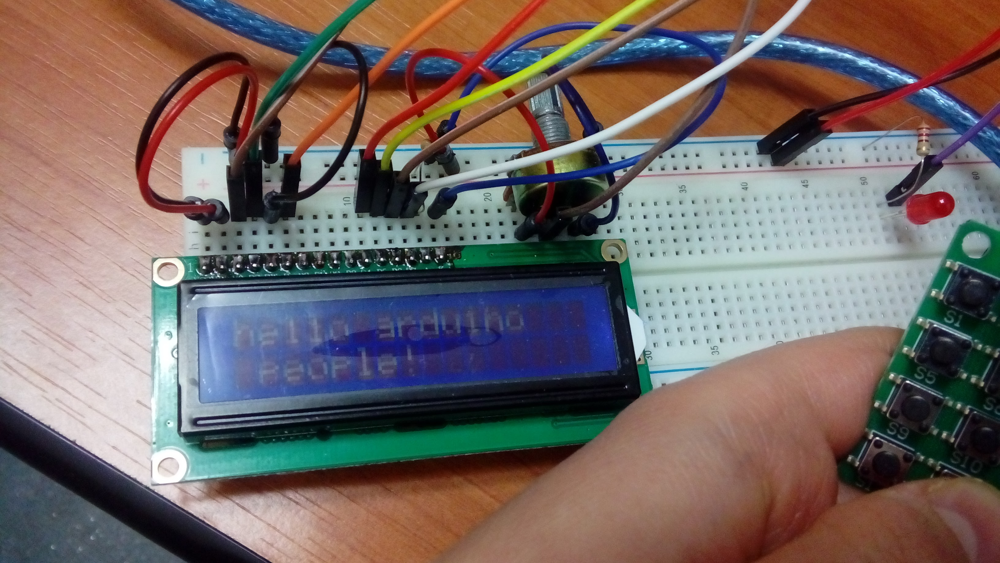
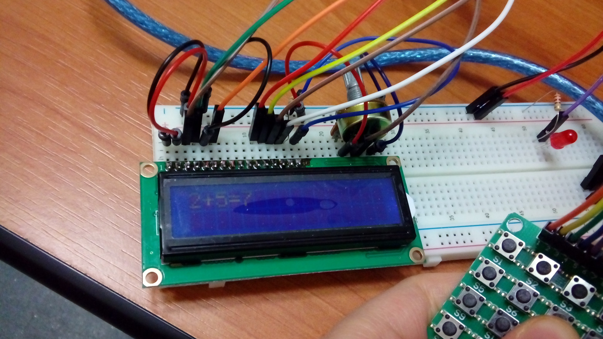
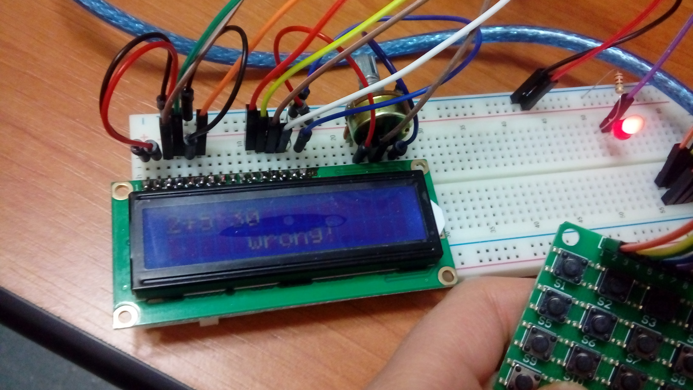

# arduino-msg-calculator
Arduino Pocket calculator &amp; Text messaging tool

The system will receive alphanumeric characters from a 4x4 matrix keypad, using the multiple pressing principle used on old mobile phones.
Inputs will be displayed on the lcd in real time.

A structure with the following buttons will exist:

1	2	3	E

4	5	6	<

7	8	9	X

\-	0	+	=

Functionality:
*	Key 1: “.”, “,”, “?”, “!”, “1”.
*	Key 2: “a”, “b”,  “c”, “2”.
*	Key 3: “d”, “e”, “f”, “3”.
*	Key 4: “g”, “h”. “i”, “4”.
*	Key 5: “j”, “k”, “l”, “5”.
*	Key 6: “m”, “n”, “o”, “6”.
*	Key 7: “p”, “q”, “r”, “s”, “7”.
*	Key 8: “t”, “u”, “v”, “8”.
*	Key 9: “w”, “x”, “y”, “z”, “9”.
*	Key 0: “ ”, “0”, “#”; 
-- option # evaluates the previously entered equation, displaying a corresponding message -“correct" or “wrong”- on the LCD
-- it also lights up a LED twice if the answer is right; alternatively, the LED will blink 6 times intermittently, then holding on for 2 seconds.
*	Key E: enter – introducing the next character.
*	Key <: backspace.
*	Key X: clear screen.
*	Key –: “–”,“/”  - corresponding mathematical operations.
*	Key +: “+”,“*” - corresponding mathematical operations.
*	Key =: calculates the entered operation, displaying the result.

# Diagram

 - The keypad should be a 4x4 matrix keypad with 8 pins.
 
# Results

Typing:

Perform basic operations:

Checking truth value:

# Components

- Arduino Uno board
- 16\*2 LCD display
- 4x4 matrix keypad
- 10K potentiometer
- bread board
- 220 ohms resistance
- 10K ohms resistance
- LED
- wires

# Coupling:
LCD – Arduino:

- VSS - GND
- VDD - VCC
- V0 – potentiometer middle pin
- RS – A0
- RW - GND
- E – A1
- D4 – A2
- D5 – A3
- D6 – A4
- D7 – A5
- A – a pin of the 10K resistance
- K - Gnd

4x4 Matrix Keypad - Arduino:

- pin 1 -> digital pin 9
- pin 2 -> digital pin 8
- pin 3 -> digital pin 7
- pin 4 -> digital pin 6
- pin 5 -> digital pin 5
- pin 6 -> digital pin 4
- pin 7 -> digital pin 3
- pin 8 -> digital pin 2

Potentiometer:

- left pin - Vcc
- middle pin – LCD V0
- right pin - Gnd

10K Resistance:

- end 1: LCD A (pin 15)
- end 2: Vcc

220 ohms Resistance:

- end 1: short end LED
- end 2: Gnd

LED:

- short end: connected with the resistance
- long end: digital pin 12 Arduino
